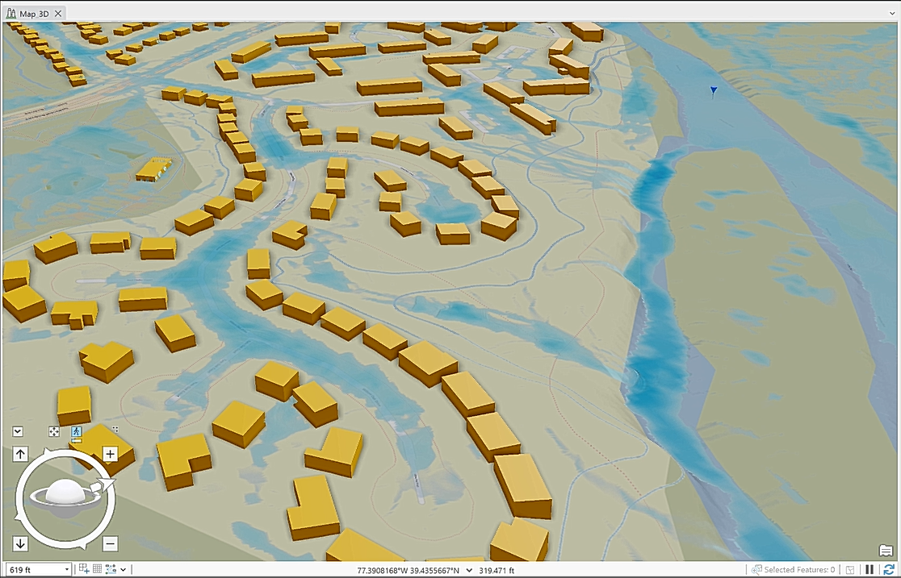
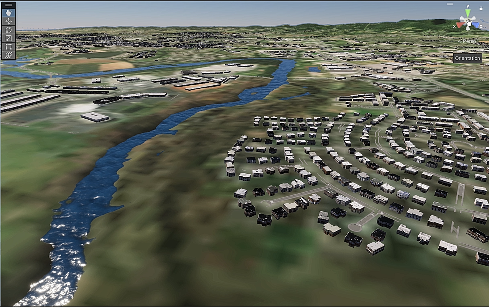
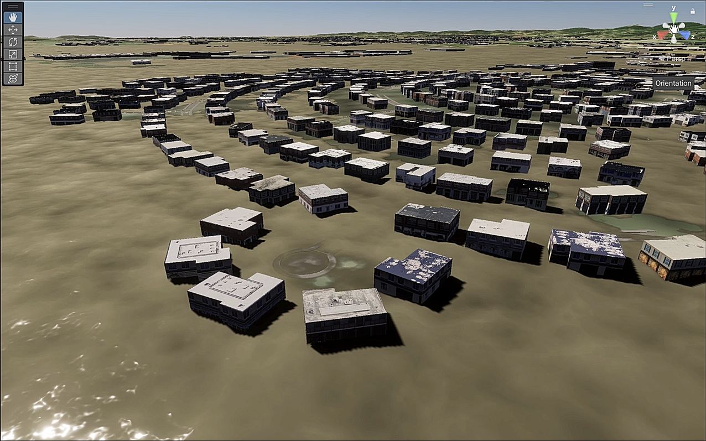

# ★ Frederick County Flood Simulation ★

## ★ Project Overview ★
This project was developed in collaboration with **Frederick County officials**, who wanted to identify **flood-prone areas** within their jurisdiction and use the insights to make **informed urban planning and emergency management decisions**.  
By combining **3D city modeling** and **flood simulation techniques**, the project delivers both **technical analysis** and **immersive visualization** to help stakeholders understand the scale and impact of potential flood events.

---

## ★ Client Problem ★
Frederick County faced challenges in:
- Identifying **which neighborhoods and infrastructures** were most vulnerable to flooding.  
- Communicating complex hydrological risks to **non-technical decision-makers and the public**.  
- Evaluating **resilience strategies** for flood-prone areas in advance of extreme weather events.  

Traditional GIS flood models provided data but lacked an intuitive, real-world visualization to support **strategic planning**.

---

## ★ Project Purpose ★
The objectives of this project were to:
- Build a **3D digital twin** of Frederick County for spatial analysis.  
- Simulate **flood scenarios** across varying water levels.  
- Provide an **interactive flood visualization tool** to support:  
  - Emergency response planning  
  - Zoning and development decisions  
  - Public communication and awareness  

---

## ★ Solution Approach ★
The project was executed in two integrated phases:

1. **3D City Modeling in ArcGIS CityEngine**
   - Created a **realistic 3D city model** of Frederick County using building footprints, terrain, and elevation data.  
   - Captured the county’s urban infrastructure and natural landscape to ensure accurate flood modeling.  
   

2. **Flood Simulation in Unity**
   - Imported the 3D city and elevation model into **Unity Engine**.  
   - Designed a **dynamic flood simulation** showing how rising water levels spread through the county.  
   - Produced a **visually engaging simulation environment** for planners and decision-makers.  

---

## ★ Tools & Technologies ★
- **ArcGIS CityEngine** → 3D city and terrain modeling  
- **Unity Engine** → Interactive flood simulation and visualization  
- **GIS Data Sources** → Elevation models, building footprints, and hydrological datasets  

---

## ★ Outcomes & Impact ★
- Delivered a **simulation environment** that showed how floods impact specific areas of Frederick County.  
- Enabled **county officials** to better identify **vulnerable neighborhoods, roads, and infrastructure**.  
- Improved **communication with the public and stakeholders** through realistic 3D visualizations.  
- Provided a framework for **data-driven planning** and **emergency preparedness**.  

---

## ★ Future Applications ★
- Integration of **real-time rainfall and hydrological models** for predictive flood alerts.  
- Expansion into **VR/AR environments** for training emergency response teams.  
- Replication of the workflow for **other counties and natural hazard simulations** (wildfires, earthquakes, etc.).  

---

