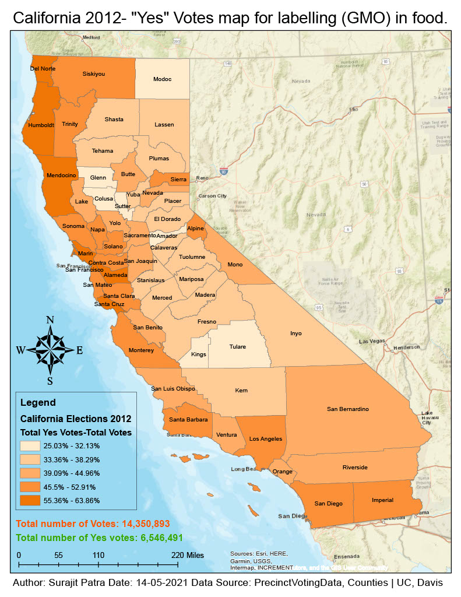

# ★ California Wildfire Impact Analysis (2012–2022) ★

## ★ Project Files ★
-  

## ★ Problem ★
Wildfires in California have grown in intensity and frequency over the last decade, leaving a significant impact on communities, ecosystems, and infrastructure.  
While raw wildfire perimeter datasets exist, decision-makers often lack **clear, county-level summaries** of the **total land area affected** over time.  
Overlapping fire boundaries and inconsistent reporting make it challenging to quantify the **true extent of land burned** in each county.

---

## ★ Purpose ★
The goal of this project was to:
- Quantify **total burned acreage** in each California county between 2012 and 2022.
- Calculate the **percentage of county area** affected by wildfires.
- Visualize wildfire impact patterns to support **recovery planning** and **resource allocation**.

---

## ★ Solution ★
Using **ArcGIS Pro** and authoritative California wildfire perimeter data, I designed a geoprocessing workflow to:
1. **Integrate** wildfire perimeters from multiple years into a single continuous burn area polygon.
2. **Intersect** the unified burn area with California county boundaries.
3. **Calculate** burned acreage and percentage of county affected.
4. **Visualize** results through a thematic map using Natural Breaks classification (5 classes).
5. **Document** metadata and export outputs for public sharing.

---

## ★ Workflow ★
1. **Data Preparation**
   - Imported California **county boundaries** and **wildfire perimeters** (2012–2022) from a File Geodatabase.
   
2. **Data Processing**
   - Dissolved 4,102 wildfire polygons into a **single burn area** feature.
   - Intersected with county boundaries to get fire-affected areas per county.
   - Calculated **area in US Survey Acres** for each affected polygon.
   - Summarized acreage by county and joined results back to the county dataset.
   - Computed **% of county area burned**.

3. **Mapping & Visualization**
   - Applied a **Natural Breaks (Jenks)** classification to visualize wildfire impact percentages.
   - Added **labels**, **legend**, **north arrow**, **scale bar**, and **basemap** for context.

4. **Export & Sharing**
   - Exported the final **PDF map** and created an **ArcGIS Map Package** for reproducibility.

---

## ★ Tools & Technologies ★
- **ArcGIS Pro** (Dissolve, Intersect, Field Calculator, Summary Statistics)
- **Coordinate System**: CA-specific projection
- **Data Storage**: File Geodatabase
- **Visualization**: Thematic mapping with classification

---

## ★ Results ★
- Produced a **county-level wildfire impact map** showing percentage of land affected (2012–2022).
- Identified high-impact counties for **emergency management prioritization**.
- Created reusable geoprocessing workflow for similar spatial analyses.
