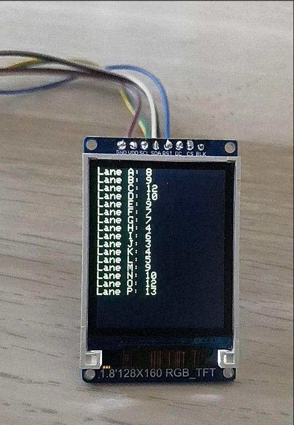
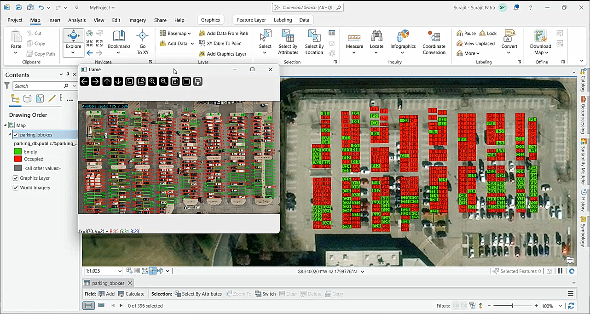

# Parking Lot Monitoring System
An AI-powered Parking Lot Monitoring System utilizing computer vision to detect and display available parking spots in real time. Integrated with ArcGIS Feature Layers for spatial visualization, this system automates parking management by providing real-time occupancy detection. Additionally, an external display unit is integrated to guide drivers with real-time parking availability.

## Key Features
✔ Real-time Parking Spot Detection using an AI model
✔ Computer Vision-Based Image Processing
✔ Integration with ArcGIS Feature Layers for spatial visualization
✔ Optimized Spot Labeling (Columns & Rows)
✔ ESP32-Based External Display for Parking Guidance

## 1. Raw Video Footage
This project processes live video footage of a parking lot to detect available parking spots.

## 2. AI-Based Parking Spot Detection
Trained an SVM classifier to classify parking spots as empty or occupied.

### Dataset Preparation
Collected images of empty and occupied parking spots
Resized images to a fixed 15×15 resolution
Flattened images into feature vectors
### Model Training & Optimization
Used GridSearchCV to optimize the hyperparameters (C and gamma) of an SVM classifier
Achieved an accuracy of X% (Replace with actual result)
Saved the best model using pickle for later inference
### AI Model Detecting Spots in Video
Once trained, the model detects parking spots in real-time video footage.

## 3. External Display for Parking Guidance
An ESP32-based external display is integrated to show real-time parking availability, helping drivers find spots easily.

### How It Works
The system calculates the number of empty spots in each column
Sends data via serial communication to an ESP32 microcontroller
Displays real-time availability on an LED screen for drivers at the parking entrance
AI Model Detecting Spots in Video
Once trained, the model detects parking spots in real-time video footage.

## 4. Integration with ArcGIS for Spatial Visualization
To enhance visualization, ArcGIS Feature Layers display parking spot availability on a web-based GIS application.

ArcGIS Web AppBuilder Integration
Imported parking bounding boxes from a shapefile (.shp)
Updated Feature Layers dynamically with real-time occupancy data
Real-time Status Updates
Bound each parking spot’s status (empty/occupied) to GIS attributes
Enabled real-time visualization on ArcGIS Online

Although the location is not exactly the same as shown in the video since it was difficult to get the exact coordinates of the parking lot, a testing location was selected for proof of concept.

## 5. Real-World Impact
This project solves a common urban problem—finding an available parking spot.

Time & Fuel Efficiency 🚗⛽
Reduces the time spent searching for parking
Lowers fuel consumption and carbon emissions
Improved Traffic Flow 🚦
Prevents congestion in high-density parking areas
Reduces vehicle idling and blockages
Smart City Integration 🏙️
Can be extended to integrate with smart parking payment systems
Supports real-time updates via a mobile app
Enhanced Accessibility ♿
Can be modified to highlight accessible parking spots for disabled drivers
